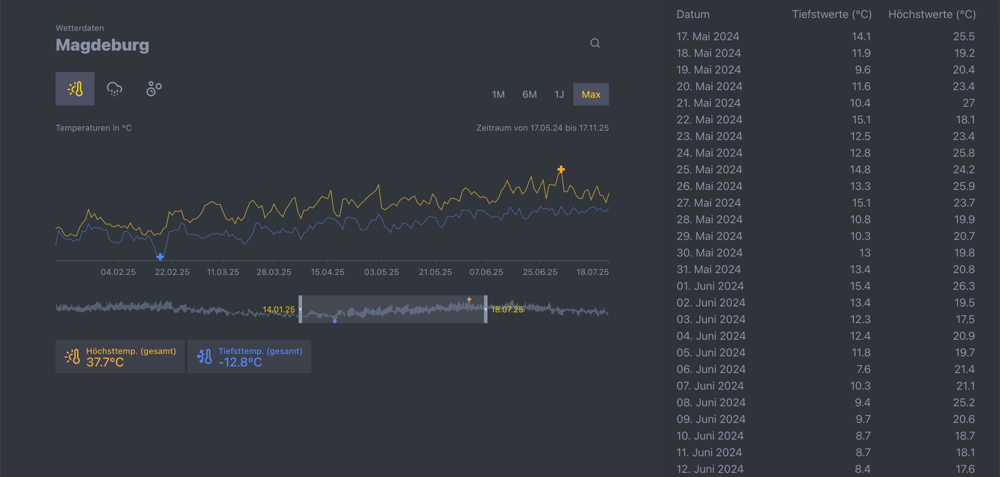

Daily Weather Data from Magdeburg Germany



This project visualizes daily climate observations for Magdeburg, Germany using datasets from the German Weather Service (DWD).

**Frameworks & Tools**

- **React:** UI library used for building the application (`react`, `react-dom`).
- **TypeScript:** static typing (`typescript`).
- **Vite:** development server and build tool (`vite`).
- **Tailwind CSS:** utility-first styling (`tailwindcss`, `@tailwindcss/postcss`).
- **Shadcn** UI primitives.
- **TanStack:** collection of utilities used in the project (`@tanstack/react-start`, `@tanstack/react-query`, `@tanstack/react-router`, `@tanstack/react-table`).
- **Recharts:** charting library for visualizations (`recharts`).
- **Biome:** linting and formatting (`@biomejs/biome`).
- **Vitest:** test runner (`vitest`).
- **Nitro:** server tooling (`nitro`).

# Getting Started

To run this application:

```bash
npm install
npm run start
```

# Building For Production

To build this application for production:

```bash
npm run build
```

## Testing

This project uses [Vitest](https://vitest.dev/) for testing. You can run the tests with:

```bash
npm run test
```

or

```bash
npm run test:watch
```

## Styling

This project uses [Tailwind CSS](https://tailwindcss.com/) for styling.

## Linting & Formatting

This project uses [Biome](https://biomejs.dev/) for linting and formatting. The following scripts are available:

```bash
npm run lint
npm run format
npm run check
```

## Shadcn

Add components using the latest version of [Shadcn](https://ui.shadcn.com/).

```bash
pnpx shadcn@latest add button
```

## Weather Data

This project uses daily climate data downloaded from the German Weather Service (DWD):

https://www.dwd.de/DE/leistungen/klimadatendeutschland/klarchivtagmonat.html?nn=16102

Usage notes:

- **Save the original TXT file** you downloaded from the DWD into the repository `data/` folder (for example: `./data/produkt_klima_tag_20240517_20251117_03126.txt`).
- **Convert the TXT to JSON** using the included converter script. Example:

```bash
# convert a specific source TXT into a target JSON inside the data folder
npm run convert:data ./data/produkt_klima_tag_20240517_20251117_03126.txt ./data/produkt_klima_tag_20240517_20251117_03126.json
```

- After conversion the app expects the JSON file to live in the `data/` folder. If the filename or location differs, update the data path constant in `src/lib/loadMagdeburgData.ts`.

Where to change the data path

- Open `src/lib/loadMagdeburgData.ts` and update the `DATA_FILE` constant (or the path used by the loader) to point to the JSON file you produced (for example `./data/produkt_klima_...json`).


- If you want to control the image display size on GitHub, use raw HTML in the README:

```html

```

- Tip: keep screenshots under ~1-2 MB for faster loading. For docs sites or Vite-based previews, put static assets in `public/` so they are served correctly.
